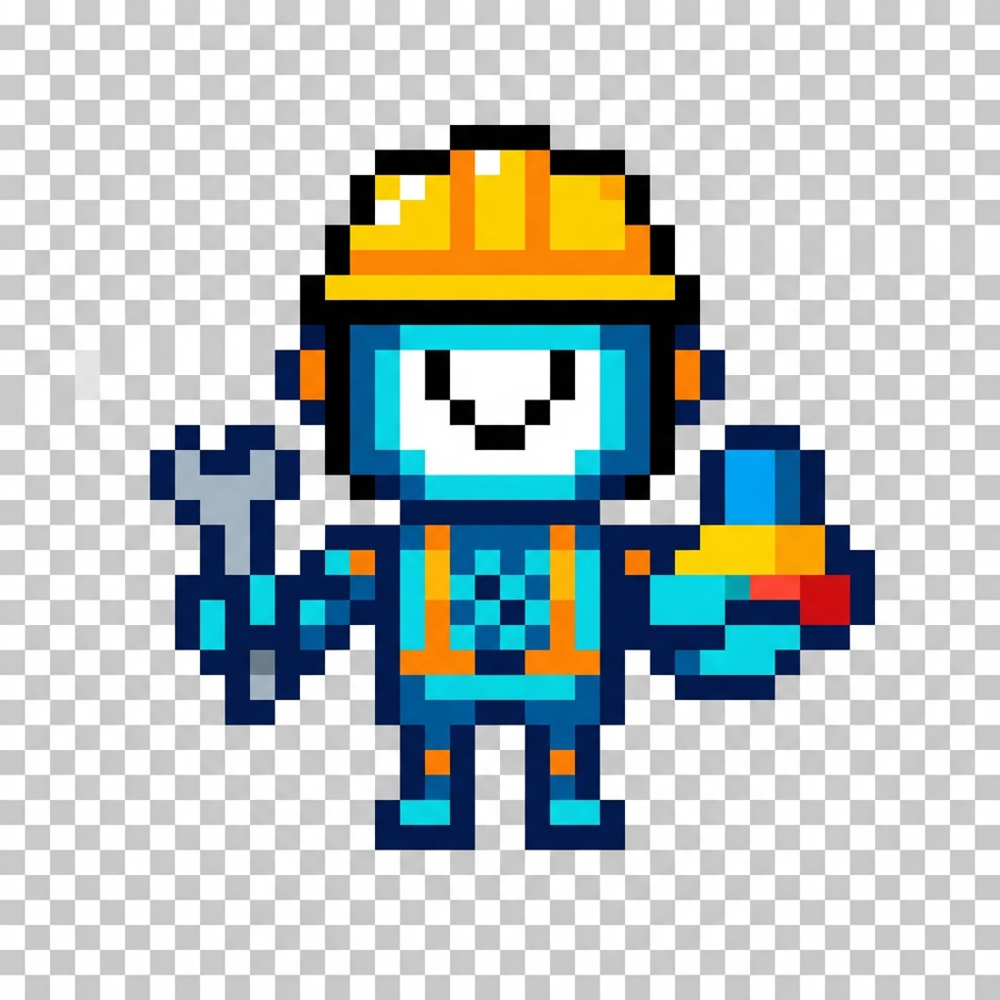

<div align="center">

<!-- Flutter Animated Header -->


<br/>

# ✨ Smart Keyboard Assistant ✨


<br/>

<!-- Flutter Badges Row -->
<a href="https://flutter.dev"></a>
<a href="https://dart.dev"></a>
<a href="https://ai.google.dev"></a>
<a href="#"></a>

<br/><br/>

<!-- Pixel Character -->


<br/>

### 🚧 *Under Construction - Making AI magic happen!* 🚧

<br/>


</div>

---

<div align="center">

## 🎨 Built with Flutter Colors


</div>

---

## 🌟 Features

<table>
<tr>
<td>

### ✏️ **Grammar & Spelling**
```
🔍 Real-time error detection
✨ AI-powered corrections
📝 Inline suggestions
⚡ 800ms debounce
```

</td>
<td>

### 🎭 **Tone Transformation**
```
😊 Friendly    - Warm & casual
💼 Professional - Formal & polished
🎉 Casual     - Fun & relaxed
🎩 Formal     - Respectful & proper
```

</td>
</tr>
<tr>
<td>

### 🇮🇳 **9 Languages**
```
🔹 Hindi     हिंदी
🔹 Tamil     தமிழ்
🔹 Telugu    తెలుగు
🔹 Bengali   বাংলা
🔹 Marathi   मराठी
🔹 Gujarati  ગુજરાતી
🔹 Kannada   ಕನ್ನಡ
🔹 Malayalam മലയാളം
🔹 Punjabi   ਪੰਜਾਬੀ
```

</td>
<td>

### 🔐 **Privacy First**
```
🛡️ Secure local storage
🔑 Encrypted API keys
📵 No data tracking
✅ Your data, your device
```

</td>
</tr>
</table>

---

<div align="center">

## 🏗️ Architecture


</div>

```
╔═══════════════════════════════════════════════════════════════╗
║                                                               ║
║   ┌─────────────────────────────────────────────────────────┐ ║
║   │               🎨 PRESENTATION LAYER                     │ ║
║   │  ┌──────────┐  ┌──────────┐  ┌──────────┐  ┌──────────┐│ ║
║   │  │  Splash  │  │  Setup   │  │   Home   │  │ Settings ││ ║
║   │  │  Screen  │  │  Screen  │  │  Screen  │  │  Screen  ││ ║
║   │  └────┬─────┘  └────┬─────┘  └────┬─────┘  └────┬─────┘│ ║
║   │       └─────────────┴──────┬──────┴─────────────┘      │ ║
║   │                            │                            │ ║
║   │  ┌─────────────────────────▼───────────────────────────┐│ ║
║   │  │          🔄 RIVERPOD PROVIDERS                      ││ ║
║   │  │   ApiKeyProvider │ TextEditorProvider │ Language   ││ ║
║   │  └─────────────────────────┬───────────────────────────┘│ ║
║   └──────────────────────────────────────────────────────────┘ ║
║                                │                               ║
║   ┌──────────────────────────────────────────────────────────┐ ║
║   │               📦 DATA LAYER                              │ ║
║   │  ┌──────────┐  ┌──────────┐  ┌──────────┐               │ ║
║   │  │  Models  │  │ Services │  │Repository│               │ ║
║   │  └──────────┘  └────┬─────┘  └──────────┘               │ ║
║   └──────────────────────────────────────────────────────────┘ ║
║                          │                                     ║
║   ┌──────────────────────▼───────────────────────────────────┐ ║
║   │               🤖 GEMINI AI                               │ ║
║   │         Grammar • Tone • Translation                     │ ║
║   └──────────────────────────────────────────────────────────┘ ║
║                                                               ║
╚═══════════════════════════════════════════════════════════════╝
```

---

<div align="center">

## 📁 Project Structure

</div>

```dart
/// 🎮 Smart Keyboard App Structure
///
/// lib/
/// ├── 📱 main.dart              // App entry point
/// ├── 🎯 app.dart               // MaterialApp & Routes
/// │
/// ├── 🎨 core/
/// │   ├── constants/
/// │   │   ├── app_constants.dart    // API URLs, timing
/// │   │   ├── tone_presets.dart     // 4 tone types
/// │   │   └── indian_languages.dart // 9 languages
/// │   ├── theme/
/// │   │   └── app_theme.dart        // Material 3 theme
/// │   └── utils/
/// │       └── validators.dart       // Input validation
/// │
/// ├── 📦 data/
/// │   ├── models/
/// │   │   ├── text_suggestion.dart  // Grammar results
/// │   │   └── translation_result.dart
/// │   ├── services/
/// │   │   ├── gemini_service.dart   // AI integration
/// │   │   ├── storage_service.dart  // Secure storage
/// │   │   └── translation_service.dart
/// │   └── repositories/
/// │       └── ai_repository.dart    // Data aggregation
/// │
/// └── 🖼️ presentation/
///     ├── providers/
///     │   ├── api_key_provider.dart
///     │   ├── text_editor_provider.dart
///     │   └── language_provider.dart
///     ├── screens/
///     │   ├── splash_screen.dart
///     │   ├── setup_screen.dart
///     │   ├── home_screen.dart
///     │   └── settings_screen.dart
///     └── widgets/
///         ├── text_editor_widget.dart
///         ├── tone_selector_widget.dart
///         ├── language_selector_widget.dart
///         └── suggestion_card_widget.dart
```

---

<div align="center">

## 🚀 Quick Start


</div>

### Prerequisites

| Requirement | Version | Status |
|:-----------:|:-------:|:------:|
| Flutter SDK | ^3.10.4 | ✅ |
| Dart SDK | Latest | ✅ |
| Gemini API Key | Free | 🔑 |

### Installation

```bash
# Clone the magic ✨
git clone https://github.com/AditthyaSS/ai-keyboard-app.git

# Enter the realm 🚪
cd ai-keyboard-app

# Summon dependencies 📦
flutter pub get

# Launch! 🚀
flutter run
```

<div align="center">

### 🔑 Get Your Free API Key

<a href="https://makersuite.google.com/app/apikey">
  
</a>

</div>

---

<div align="center">

## 📊 Tech Specs


</div>

| Category | Technology |
|:--------:|:----------:|
| 🎯 Framework | Flutter 3.10+ |
| 📝 Language | Dart |
| 🔄 State | Riverpod |
| 🤖 AI | Google Gemini |
| 🎨 Design | Material 3 |
| 🔐 Storage | flutter_secure_storage |
| ✨ Animations | flutter_animate |

---

<div align="center">

## 🤝 Contributing


**We'd love your help!**

<a href="https://github.com/AditthyaSS/ai-keyboard-app/fork">
  
</a>

</div>

```
1. 🍴 Fork it
2. 🌿 Create your branch (git checkout -b feature/amazing)
3. 💾 Commit changes (git commit -m 'Add amazing feature')
4. 📤 Push it (git push origin feature/amazing)
5. 🎯 Open a Pull Request
```

---

<div align="center">

## 📜 License


This project is licensed under the MIT License

---

<br/>


**Made with 💙 and Flutter**


</div>
